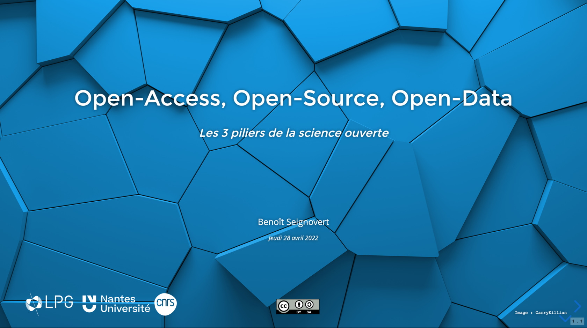

Open-access, open-source, open-data : 3 piliers pour une science ouverte
========================================================================
_2022-04-28 - B. Seignovert_

> Depuis la publication de la loi sur une République numérique en 2016,
> la recherche française s'implique de plus en plus dans une démarche
> d'ouverture de la science. Cette démarche, loin d'être isolée, est
> très fortement poussée au niveau européen et international afin de
> facilité la découverte, l’accessibilité, l'interopérabilité et la
> réutilisation des données, des logiciels et des publications scientifiques.
>
> Durant ce séminaire nous nous concentrerons sur les concepts d'open-access,
> open-source et open-data qui constituent les 3 piliers pour promouvoir
> une science ouverte. Nous verrons notamment pourquoi "ouvert" ne veut
> pas dire "gratuit". Nous essayerons également de démystifier les notions
> de copyright et copyleft dans le cadre des licences ouvertes, pour pouvoir
> distinguer ce qui est réutilisable de ce qui ne l'est pas en s'appuyant sur
> des exemples concrets. Enfin nous verrons quels sont les nouveaux droits et
> devoirs des chercheurs français dans le cadre du plan national pour la science ouverte.

Ce dépôt contient les sources de cette présentation.

Le support est consultable ici: [slides.com/seignovert/open-science](https://slides.com/seignovert/open-science)
et distribué sous license [`CC-BY-SA 4.0`](https://creativecommons.org/licenses/by-nc-sa/4.0/deed.fr).
